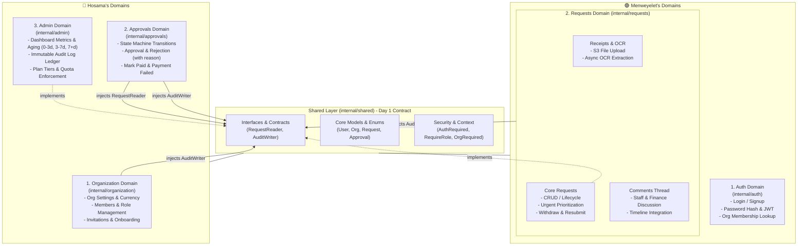
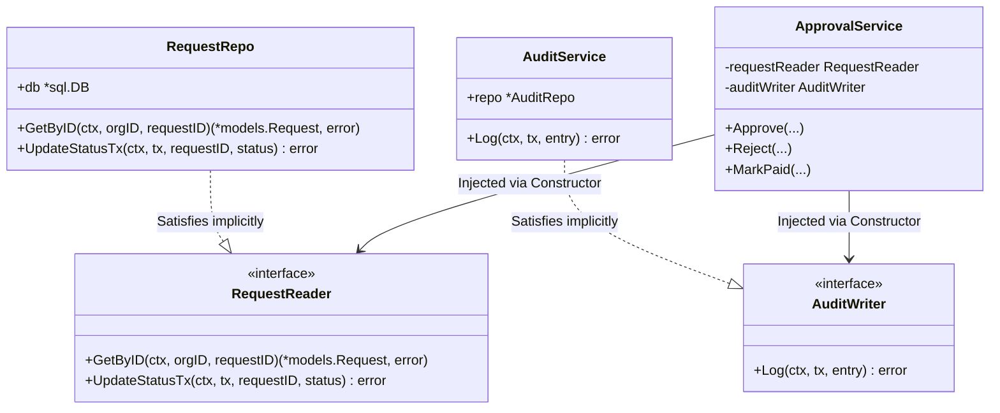

# ⚡ SETTLE — Backend Domain Classification & Implementation Guide

> _Two developers. Nine days. Consolidated domains. Zero blockers._

---

## 📑 Table of Contents

1. [Architectural Overview & The Clean Split](#-architectural-overview--the-clean-split)
2. [Domain Architecture Diagram](#-domain-architecture-diagram)
3. [🟢 MENWEYELET — 2 Consolidated Domains](#-menweyelet--2-consolidated-domains)
   - [Domain 1: Auth (`internal/auth/`)](#domain-1-auth-internalauth)
   - [Domain 2: Requests (`internal/requests/`)](#domain-2-requests-internalrequests)
     - [Sub-Domain 2.1: Core Requests Lifecycle](#sub-domain-21-core-requests-lifecycle)
     - [Sub-Domain 2.2: Receipts & OCR Engine](#sub-domain-22-receipts--ocr-engine)
     - [Sub-Domain 2.3: Comments & Collaboration](#sub-domain-23-comments--collaboration)
4. [🔵 HOSAMA — 3 Consolidated Domains](#-hosama--3-consolidated-domains)
   - [Domain 1: Organization (`internal/organization/`)](#domain-1-organization-internalorganization)
     - [Sub-Domain 1.1: Organization Lifecycle & Settings](#sub-domain-11-organization-lifecycle--settings)
     - [Sub-Domain 1.2: Members & Roles](#sub-domain-12-members--roles)
     - [Sub-Domain 1.3: Invitations & Onboarding](#sub-domain-13-invitations--onboarding)
   - [Domain 2: Approvals (`internal/approvals/`)](#domain-2-approvals-internalapprovals)
     - [Decision Engine & State Machine](#decision-engine--state-machine)
     - [Settlement & Disbursement Tracking](#settlement--disbursement-tracking)
   - [Domain 3: Admin (`internal/admin/`)](#domain-3-admin-internaladmin)
     - [Sub-Domain 3.1: Executive Dashboard & Stats](#sub-domain-31-executive-dashboard--stats)
     - [Sub-Domain 3.2: Immutable Audit Log](#sub-domain-32-immutable-audit-log)
     - [Sub-Domain 3.3: Billing & Subscription Tiers](#sub-domain-33-billing--subscription-tiers)
5. [🤝 Non-Blocking Architecture & Service Injection Blueprint](#-non-blocking-architecture--service-injection-blueprint)
   - [The Problem: Circular Imports & Coupling](#the-problem-circular-imports--coupling)
   - [The Solution: Interface-Based Dependency Inversion](#the-solution-interface-based-dependency-inversion)
   - [Step 1: Interface Contracts in Shared Layer](#step-1-interface-contracts-in-shared-layer)
   - [Step 2: Concrete Implementation in Requests & Admin](#step-2-concrete-implementation-in-requests--admin)
   - [Step 3: Constructor Injection in Consumer Services](#step-3-constructor-injection-in-consumer-services)
   - [Step 4: Mocking for Instant Parallel Unit Testing](#step-4-mocking-for-instant-parallel-unit-testing)
   - [Step 5: Wiring the Composition Root (`main.go`)](#step-5-wiring-the-composition-root-maingo)
6. [📂 Unified Project Directory Tree](#-unified-project-directory-tree)
7. [🚦 Unified Router Setup](#-unified-router-setup)
8. [📅 Updated 9-Day Parallel Schedule](#-updated-9-day-parallel-schedule)
9. [🌿 Git Branch Strategy](#-git-branch-strategy)
10. [🏁 Database Migrations Ownership](#-database-migrations-ownership)

---

## 🎯 Architectural Overview & The Clean Split

To maximize developer velocity and completely eliminate cross-package circular dependencies, all backend responsibilities are organized into **5 core domains**:

- **🟢 Menweyelet (2 Domains)**: Owns identity and the requester workflow (Auth + Requests, with Receipts and Comments nested inside Requests).
- **🔵 Hosama (3 Domains)**: Owns organizational tenancy, decision-making, and administrative oversight (Organization + Approvals + Admin).

### The Split at a Glance

| Metric | 🟢 **Menweyelet** | 🔵 **Hosama** |
|---|---|---|
| **Role Title** | Core Platform & Requester Engine | Tenancy, Approvals & Operations Engine |
| **Consolidated Domains** | **2 Domains**: <br>1. `auth` <br>2. `requests` (incl. Receipts & Comments) | **3 Domains**: <br>1. `organization` (incl. Members & Invites) <br>2. `approvals` <br>3. `admin` (incl. Dashboard, Audit & Billing) |
| **Packages** | `internal/auth/`<br>`internal/requests/` | `internal/organization/`<br>`internal/approvals/`<br>`internal/admin/` |
| **Database Tables** | `users`, `requests`, `receipts`, `comments` | `organizations`, `org_members`, `invitations`, `approvals`, `audit_log` |
| **Endpoints Owned** | 12 endpoints | 17 endpoints |
| **Complexity Profile** | Authentication, JWT, Multipart Upload, S3, OCR Background Workers | State Machine, Financial Multi-tenancy, Dynamic Query Aggregations, Audit Trails |
| **Cross-Dependency** | Exposes `RequestReader` via `internal/shared/interfaces` | Exposes `AuditWriter` via `internal/shared/interfaces` |

> [!IMPORTANT]
> **Zero Functionality Lost**: Every single endpoint, query, table, validation, and workflow from the initial specification is preserved. The consolidation simplifies package imports and provides clear domain boundaries.

---

## 🗺️ Domain Architecture Diagram



---

## 🟢 MENWEYELET — 2 Consolidated Domains

---

### Domain 1: Auth (`internal/auth/`)

**Responsibility:** User identity, authentication, credential validation, and JWT generation.

#### Endpoints
| Method | Route | Description | Auth Required | Roles |
|---|---|---|---|---|
| `POST` | `/v1/auth/signup` | Register a new user account | Public | Any |
| `POST` | `/v1/auth/login` | Authenticate credentials and return signed JWT | Public | Any |

#### Package Layout
```
internal/auth/
├── dto/
│   ├── login_request.go          → { email, password }
│   ├── login_response.go         → { token, user, orgs }
│   └── signup_request.go         → { email, password, name }
├── handler/
│   └── auth_handler.go           → HTTP translation, binds JSON, handles response
├── repository/
│   └── user_repo.go              → Queries `users` and joins `org_members`
├── service/
│   └── auth_service.go           → Login & signup business logic, password compare
└── validator/
    └── auth_validator.go         → Email regex, minimum password complexity
```

#### Service Implementation
```go
package service

import (
    "context"
    "settle/internal/auth/dto"
    "settle/internal/auth/repository"
    "settle/internal/shared/service"
    "settle/internal/shared/utils"
)

type AuthService struct {
    userRepo    *repository.UserRepo
    jwtService  *service.JWTService
    hashService *service.HashService
}

func NewAuthService(
    userRepo *repository.UserRepo,
    jwtService *service.JWTService,
    hashService *service.HashService,
) *AuthService {
    return &AuthService{
        userRepo:    userRepo,
        jwtService:  jwtService,
        hashService: hashService,
    }
}

func (s *AuthService) Login(ctx context.Context, req dto.LoginRequest) (*dto.LoginResponse, error) {
    user, err := s.userRepo.FindByEmail(ctx, req.Email)
    if err != nil || user == nil {
        return nil, utils.NewUnauthorizedError("Invalid email or password")
    }

    if !s.hashService.Compare(req.Password, user.PasswordHash) {
        return nil, utils.NewUnauthorizedError("Invalid email or password")
    }

    memberships, err := s.userRepo.GetOrgMemberships(ctx, user.ID)
    if err != nil {
        return nil, utils.NewInternalError("Failed to fetch user memberships")
    }

    // Default to the first active organization if available
    var activeOrgID, activeRole string
    if len(memberships) > 0 {
        activeOrgID = memberships[0].OrgID
        activeRole = memberships[0].Role
    }

    token, err := s.jwtService.Generate(user.ID, user.Email, activeOrgID, activeRole)
    if err != nil {
        return nil, utils.NewInternalError("Failed to issue authorization token")
    }

    return &dto.LoginResponse{
        Token: token,
        User:  dto.ToUserSummary(user),
        Orgs:  memberships,
    }, nil
}
```

---

### Domain 2: Requests (`internal/requests/`)

**Responsibility:** The end-to-end requester domain. Houses core payout requests, receipt attachments with background OCR, and discussion comments in one cohesive package.

#### Consolidated Sub-Domains
1. **Core Requests**: Submission, listing with SLA urgency ranking, detailed timeline assembly, withdrawal, and resubmission.
2. **Receipts & OCR**: Multipart file upload to S3/MinIO, async background OCR parsing, and extraction persistence.
3. **Comments**: Discussion threads attached to payout requests with contextual role tagging.

#### Endpoints
| Method | Route | Description | Auth | Roles |
|---|---|---|---|---|
| `POST` | `/v1/requests` | Submit a new payout request | Yes | `staff`, `org_admin` |
| `GET` | `/v1/requests` | List requests (Staff sees own, Finance sees all) | Yes | All members |
| `GET` | `/v1/requests/:id` | Full request detail (includes receipt, approval, comments) | Yes | All members |
| `GET` | `/v1/requests/:id/previous` | Requester's historical request track record | Yes | `finance`, `org_admin` |
| `PUT` | `/v1/requests/:id/withdraw` | Requester cancels pending request | Yes | `staff` (Owner only) |
| `POST` | `/v1/requests/:id/resubmit` | Create new request from rejected/failed one | Yes | `staff` (Owner only) |
| `POST` | `/v1/receipts/upload` | Upload receipt image/PDF & trigger async OCR | Yes | All members |
| `GET` | `/v1/receipts/:id` | Get receipt metadata and OCR extraction results | Yes | All members |
| `POST` | `/v1/requests/:id/comments` | Post a comment on a request | Yes | Owner, Finance, Admin |
| `GET` | `/v1/requests/:id/comments` | List discussion thread for a request | Yes | Owner, Finance, Admin |

#### Package Layout
```
internal/requests/
├── dto/
│   ├── create_request.go         → { type, amount, purpose, urgency, receipt_id }
│   ├── request_response.go       → RequestDetail with nested receipt, approval, comments
│   ├── request_list_response.go  → Paginated request cards with days_pending
│   ├── resubmit_request.go       → Overrides for previous rejected request
│   ├── receipt_dto.go            → { file_url, ocr_status, extracted_amount, ... }
│   └── comment_dto.go            → { text, author_id, author_role, created_at }
├── handler/
│   ├── request_handler.go        → HTTP handlers for 6 request routes
│   ├── receipt_handler.go        → Handles file upload and receipt queries
│   └── comment_handler.go        → Handles comment creation and retrieval
├── repository/
│   ├── request_repo.go           → All SQL queries on `requests` table (implements RequestReader)
│   ├── receipt_repo.go           → All SQL queries on `receipts` table
│   └── comment_repo.go           → All SQL queries on `comments` table
├── service/
│   ├── request_service.go        → Business rules, ID generator, status validations
│   ├── receipt_service.go        → Uploads to S3, triggers async OCR worker
│   └── comment_service.go        → Adds comments, verifies permission on request
└── validator/
    └── request_validator.go      → Max amounts, purpose length, file mime types
```

#### Core Business Logic: Request ID Generator & Priority Query
```go
// service/request_service.go
func (s *RequestService) generateID(ctx context.Context, tx *sql.Tx) (string, error) {
    var nextSeq int64
    err := tx.QueryRowContext(ctx, "SELECT nextval('request_id_seq')").Scan(&nextSeq)
    if err != nil {
        return "", err
    }
    return fmt.Sprintf("REQ-%06d", nextSeq), nil
}
```

```sql
-- Dynamic SQL for List Requests (ordered by urgency and age)
SELECT 
    r.id, r.amount, r.purpose, r.type, r.urgency, r.status, r.created_at,
    u.name AS requester_name, u.email AS requester_email,
    EXTRACT(DAY FROM NOW() - r.created_at)::int AS days_pending
FROM requests r
JOIN users u ON r.requester_id = u.id
WHERE r.org_id = $1
  AND ($2 = '' OR r.status = $2)
  AND ($3 = '' OR r.urgency = $3)
  AND ($4 = '' OR r.requester_id = $4)
ORDER BY
  CASE r.urgency
    WHEN 'critical' THEN 1
    WHEN 'urgent'   THEN 2
    WHEN 'routine'  THEN 3
  END ASC,
  r.created_at ASC
LIMIT $5 OFFSET $6;
```

#### Embedded Receipts & Async OCR Engine
```go
// service/receipt_service.go
func (s *ReceiptService) Upload(ctx context.Context, orgID string, header *multipart.FileHeader) (*models.Receipt, error) {
    file, err := header.Open()
    if err != nil {
        return nil, err
    }
    defer file.Close()

    s3Key := fmt.Sprintf("receipts/%s/%s%s", orgID, uuid.New().String(), filepath.Ext(header.Filename))
    fileURL, err := s.fileService.Upload(ctx, s3Key, file, header.Header.Get("Content-Type"))
    if err != nil {
        return nil, utils.NewInternalError("Failed to store file in object storage")
    }

    receipt := &models.Receipt{
        ID:        uuid.New().String(),
        OrgID:     orgID,
        FileURL:   fileURL,
        FileName:  header.Filename,
        FileSize:  header.Size,
        FileType:  header.Header.Get("Content-Type"),
        OCRStatus: enums.OCRStatusPending,
    }

    if err := s.receiptRepo.Create(ctx, receipt); err != nil {
        return nil, err
    }

    // Launch Async OCR Worker without blocking HTTP request
    go s.runAsyncOCR(context.Background(), receipt.ID, fileURL)

    return receipt, nil
}

func (s *ReceiptService) runAsyncOCR(ctx context.Context, receiptID, fileURL string) {
    // Simulated or cloud OCR extraction
    extracted, err := s.ocrClient.Extract(ctx, fileURL)
    if err != nil {
        _ = s.receiptRepo.UpdateOCRStatus(ctx, receiptID, enums.OCRStatusFailed, nil)
        return
    }
    _ = s.receiptRepo.UpdateOCRStatus(ctx, receiptID, enums.OCRStatusSuccess, extracted)
}
```

---

## 🔵 HOSAMA — 3 Consolidated Domains

---

### Domain 1: Organization (`internal/organization/`)

**Responsibility:** Tenancy boundary, company profile, currency configuration, member directory, role assignment, and email invitation onboarding.

#### Consolidated Sub-Domains
1. **Org Profile & Settings**: Multi-tenant isolation, name, currency, slug generation.
2. **Members & Roles**: Member directory, removing users, changing roles (`staff` ↔ `finance`).
3. **Invitations & Onboarding**: Cryptographically secure invite tokens, email invitations, invite acceptance workflow.

#### Endpoints
| Method | Route | Description | Auth | Roles |
|---|---|---|---|---|
| `POST` | `/v1/organizations` | Create new organization (creator becomes `org_admin`) | Yes | Authenticated User |
| `GET` | `/v1/organizations/:id` | Fetch organization details | Yes | Member of Org |
| `PUT` | `/v1/organizations/:id` | Update organization name, default currency | Yes | `org_admin` |
| `GET` | `/v1/organizations/:id/members` | List all members in the organization | Yes | `org_admin`, `finance` |
| `DELETE` | `/v1/organizations/:id/members/:uid` | Remove a member from the organization | Yes | `org_admin` |
| `PUT` | `/v1/organizations/:id/members/:uid/role` | Update a member's role | Yes | `org_admin` |
| `POST` | `/v1/organizations/:id/invitations` | Generate and dispatch invitation | Yes | `org_admin` |
| `POST` | `/v1/invitations/:token/accept` | Accept invitation link, register/link user | Public | Anyone with token |

#### Package Layout
```
internal/organization/
├── dto/
│   ├── create_org.go             → { name, currency }
│   ├── update_org.go             → { name, currency }
│   ├── member_response.go        → { user_id, name, email, role, joined_at }
│   ├── invite_request.go         → { email, role }
│   └── accept_invite.go          → { name, password }
├── handler/
│   ├── org_handler.go            → Org CRUD endpoints
│   ├── member_handler.go         → Member list, role change, removal
│   └── invitation_handler.go     → Create and accept invitations
├── repository/
│   ├── org_repo.go               → `organizations` table queries
│   ├── member_repo.go            → `org_members` table queries
│   └── invitation_repo.go        → `invitations` table queries
├── service/
│   ├── org_service.go            → Org creation, slug generation, settings
│   ├── member_service.go         → Guard: cannot remove last admin, role check
│   └── invitation_service.go     → Token generation, expiration check, transaction
└── validator/
    └── org_validator.go          → Currency code (USD, EUR, GBP), slug validation
```

#### Slug Generator & Member Guard Implementation
```go
// service/org_service.go
func (s *OrgService) Create(ctx context.Context, userID string, dto dto.CreateOrgDTO) (*models.Organization, error) {
    slug := utils.Slugify(dto.Name)
    
    var org *models.Organization
    err := s.db.WithTransaction(ctx, func(tx *sql.Tx) error {
        var err error
        org, err = s.orgRepo.CreateTx(ctx, tx, dto.Name, slug, dto.Currency)
        if err != nil {
            return err
        }
        
        // Auto-assign creator as org_admin
        if err := s.memberRepo.AddMemberTx(ctx, tx, org.ID, userID, enums.RoleOrgAdmin); err != nil {
            return err
        }
        
        return s.auditWriter.Log(ctx, tx, models.AuditEntry{
            OrgID:    org.ID,
            ActorID:  userID,
            Action:   "org_created",
            NewValue: map[string]interface{}{"name": org.Name, "slug": org.Slug},
        })
    })
    
    return org, err
}
```

---

### Domain 2: Approvals (`internal/approvals/`)

**Responsibility:** The decision engine and disbursement state machine. Manages finance review, approvals, formal rejections, payment execution, and payment failures.

#### Endpoints
| Method | Route | Description | Auth | Roles |
|---|---|---|---|---|
| `PUT` | `/v1/requests/:id/approve` | Finance approves a pending request | Yes | `finance`, `org_admin` |
| `PUT` | `/v1/requests/:id/reject` | Finance rejects a request (mandatory reason) | Yes | `finance`, `org_admin` |
| `PUT` | `/v1/requests/:id/mark-paid` | Record successful financial payout | Yes | `finance`, `org_admin` |
| `PUT` | `/v1/requests/:id/payment-failed`| Record payout transmission failure | Yes | `finance`, `org_admin` |

#### State Machine Validation Matrix

| Action | Current Status Required | Target Request Status | Target Payment Status | Note / Constraint |
|---|---|---|---|---|
| **`Approve`** | `pending` | `approved` | `pending_payment` | Optional note accepted |
| **`Reject`** | `pending` | `rejected` | `none` | **Mandatory** non-empty reason |
| **`MarkPaid`** | `approved` | `paid` | `paid` | Payment method required |
| **`PaymentFailed`** | `approved` | `failed` | `failed` | **Mandatory** failure description |

> [!CAUTION]
> Any action attempted on a request that is NOT in the allowed source state must return an immediate HTTP `409 Conflict` error.

#### Package Layout
```
internal/approvals/
├── dto/
│   ├── approve_request.go        → { note }
│   ├── reject_request.go         → { reason } (Validated: required, min 5 chars)
│   ├── payment_request.go        → { payment_method } (bank_transfer, check, cash)
│   ├── payment_failed.go         → { failure_reason } (Validated: required)
│   └── approval_response.go      → Full approval and disbursement detail
├── handler/
│   └── approval_handler.go       → 4 decision route handlers
├── repository/
│   └── approval_repo.go          → CRUD for `approvals` table
├── service/
│   └── approval_service.go       → Injects RequestReader & AuditWriter interfaces
└── validator/
    └── approval_validator.go     → State transition rules & reason validation
```

#### Service Implementation with Service Injection
```go
package service

import (
    "context"
    "database/sql"
    "settle/internal/approvals/dto"
    "settle/internal/approvals/repository"
    "settle/internal/shared/database"
    "settle/internal/shared/enums"
    "settle/internal/shared/interfaces"
    "settle/internal/shared/models"
    "settle/internal/shared/utils"
)

type ApprovalService struct {
    approvalRepo  *repository.ApprovalRepo
    requestReader interfaces.RequestReader // ← Injected: Decoupled from Menweyelet's code
    auditWriter   interfaces.AuditWriter   // ← Injected: Decoupled logging
    db            database.TxManager
}

func NewApprovalService(
    approvalRepo *repository.ApprovalRepo,
    requestReader interfaces.RequestReader,
    auditWriter interfaces.AuditWriter,
    db database.TxManager,
) *ApprovalService {
    return &ApprovalService{
        approvalRepo:  approvalRepo,
        requestReader: requestReader,
        auditWriter:   auditWriter,
        db:            db,
    }
}

func (s *ApprovalService) Approve(ctx context.Context, orgID, requestID, approverID string, req dto.ApproveRequest) (*models.Approval, error) {
    // 1. Fetch current request via injected reader interface
    request, err := s.requestReader.GetByID(ctx, orgID, requestID)
    if err != nil {
        return nil, utils.NewNotFoundError("Request not found")
    }

    // 2. Validate strict state machine guard
    if request.Status != enums.StatusPending {
        return nil, utils.NewConflictError("Only pending requests can be approved. Current status: " + request.Status)
    }

    var approval *models.Approval
    err = s.db.WithTransaction(ctx, func(tx *sql.Tx) error {
        // a. Record decision
        var err error
        approval, err = s.approvalRepo.CreateTx(ctx, tx, models.Approval{
            RequestID:     requestID,
            ApproverID:    approverID,
            Decision:      enums.DecisionApproved,
            DecisionNote:  req.Note,
            PaymentStatus: enums.PaymentStatusPending,
        })
        if err != nil {
            return err
        }

        // b. Update request status via injected interface
        if err := s.requestReader.UpdateStatusTx(ctx, tx, requestID, enums.StatusApproved); err != nil {
            return err
        }

        // c. Write immutable audit log
        return s.auditWriter.Log(ctx, tx, models.AuditEntry{
            OrgID:     orgID,
            RequestID: requestID,
            ActorID:   approverID,
            Action:    "request_approved",
            OldValue:  map[string]interface{}{"status": enums.StatusPending},
            NewValue:  map[string]interface{}{"status": enums.StatusApproved, "note": req.Note},
        })
    })

    return approval, err
}

func (s *ApprovalService) Reject(ctx context.Context, orgID, requestID, approverID string, req dto.RejectRequest) (*models.Approval, error) {
    request, err := s.requestReader.GetByID(ctx, orgID, requestID)
    if err != nil {
        return nil, utils.NewNotFoundError("Request not found")
    }

    if request.Status != enums.StatusPending {
        return nil, utils.NewConflictError("Only pending requests can be rejected. Current status: " + request.Status)
    }

    var approval *models.Approval
    err = s.db.WithTransaction(ctx, func(tx *sql.Tx) error {
        var err error
        approval, err = s.approvalRepo.CreateTx(ctx, tx, models.Approval{
            RequestID:     requestID,
            ApproverID:    approverID,
            Decision:      enums.DecisionRejected,
            DecisionNote:  req.Reason,
            PaymentStatus: enums.PaymentStatusNone,
        })
        if err != nil {
            return err
        }

        if err := s.requestReader.UpdateStatusTx(ctx, tx, requestID, enums.StatusRejected); err != nil {
            return err
        }

        return s.auditWriter.Log(ctx, tx, models.AuditEntry{
            OrgID:     orgID,
            RequestID: requestID,
            ActorID:   approverID,
            Action:    "request_rejected",
            OldValue:  map[string]interface{}{"status": enums.StatusPending},
            NewValue:  map[string]interface{}{"status": enums.StatusRejected, "reason": req.Reason},
        })
    })

    return approval, err
}
```

---

### Domain 3: Admin (`internal/admin/`)

**Responsibility:** System oversight, executive financial dashboards, organizational statistics, queryable audit log ledger, and billing plan management.

#### Consolidated Sub-Domains
1. **Dashboard & Analytics**: Pending queues, urgency breakdowns, SLA aging brackets (0–3 days, 3–7 days, 7+ days escalated).
2. **Audit Logging Service**: Immutable event store and query interface for compliance.
3. **Billing & Subscriptions**: Plan tier catalog, upgrades/downgrades, and monthly quota enforcement.

#### Endpoints
| Method | Route | Description | Auth | Roles |
|---|---|---|---|---|
| `GET` | `/v1/dashboard/summary` | Queue statistics, urgency breakdown, aged requests | Yes | `finance`, `org_admin` |
| `GET` | `/v1/organizations/:id/stats` | High-level organizational and financial analytics | Yes | `finance`, `org_admin` |
| `GET` | `/v1/organizations/:id/audit-log` | Filterable, paginated audit trail of all actions | Yes | `finance`, `org_admin` |
| `GET` | `/v1/billing/plans` | Public catalog of available subscription tiers | Public | Anyone |
| `PUT` | `/v1/organizations/:id/plan` | Upgrade or downgrade organization plan | Yes | `org_admin` |

#### Package Layout
```
internal/admin/
├── dto/
│   ├── dashboard_summary.go      → { pending_count, urgent_count, aging: {...}, escalated: [...] }
│   ├── org_stats.go              → { member_count, total_disbursed_cents, volume_by_status }
│   ├── audit_filter.go           → { action, actor_id, start_date, end_date, page, limit }
│   └── plan_dto.go               → { id, name, price, request_limit, user_limit }
├── handler/
│   ├── dashboard_handler.go      → Dashboard summary and stats endpoints
│   ├── audit_handler.go          → Audit query endpoint
│   └── billing_handler.go        → Plans list and plan update endpoints
├── repository/
│   ├── audit_repo.go             → Queries & inserts for `audit_log` (Implements AuditWriter)
│   └── stats_repo.go             → Aggregation queries for dashboard metrics
├── service/
│   ├── dashboard_service.go      → Computes aging buckets and escalation flags
│   ├── audit_service.go          → Manages audit records and historical queries
│   └── billing_service.go        → Plan limit enforcement and subscription changes
└── validator/
    └── plan_validator.go         → Ensures plan ID is valid ("free", "starter", "pro")
```

#### High-Performance Dashboard Aggregations
```sql
-- Single-pass aging calculation for finance queue
SELECT
    COUNT(*) FILTER (WHERE status = 'pending') AS total_pending,
    COUNT(*) FILTER (WHERE status = 'pending' AND urgency = 'critical') AS critical_pending,
    COUNT(*) FILTER (WHERE status = 'pending' AND urgency = 'urgent') AS urgent_pending,
    COUNT(*) FILTER (WHERE status = 'pending' AND EXTRACT(DAY FROM NOW() - created_at) <= 3) AS pending_0_to_3_days,
    COUNT(*) FILTER (WHERE status = 'pending' AND EXTRACT(DAY FROM NOW() - created_at) BETWEEN 4 AND 7) AS pending_3_to_7_days,
    COUNT(*) FILTER (WHERE status = 'pending' AND EXTRACT(DAY FROM NOW() - created_at) > 7) AS pending_escalated_7_plus_days
FROM requests
WHERE org_id = $1;
```

---

## 🤝 Non-Blocking Architecture & Service Injection Blueprint

### The Problem: Circular Imports & Coupling
In standard Go development, if `Approvals` imports `Requests` to inspect request records, and `Requests` imports `Approvals` to show approval decisions on the detail view, the Go compiler **fails immediately with a circular dependency error (`import cycle not allowed`)**.

Furthermore, if Hosama has to wait for Menweyelet to finish implementing his SQL queries before testing approval flows, **Hosama is blocked for days**.

### The Solution: Interface-Based Dependency Inversion
By defining small, consumer-driven interfaces in `internal/shared/interfaces/`, we achieve:
1. **Zero Circular Imports**: Both developers only import `shared`.
2. **Zero Blockers**: Hosama writes mock implementations and tests his entire service on Day 1.
3. **Clean Unit Tests**: 100% test coverage without running a database.



---

### Step 1: Interface Contracts in Shared Layer

Locked together on **Day 1** inside `internal/shared/interfaces/`:

```go
// internal/shared/interfaces/request_reader.go
package interfaces

import (
    "context"
    "database/sql"
    "settle/internal/shared/models"
)

// RequestReader allows other domains to read and update request state
// without depending on the internal/requests package.
type RequestReader interface {
    GetByID(ctx context.Context, orgID, requestID string) (*models.Request, error)
    UpdateStatusTx(ctx context.Context, tx *sql.Tx, requestID, status string) error
}
```

```go
// internal/shared/interfaces/audit_writer.go
package interfaces

import (
    "context"
    "database/sql"
    "settle/internal/shared/models"
)

// AuditWriter allows any domain to append an immutable audit log entry.
type AuditWriter interface {
    Log(ctx context.Context, tx *sql.Tx, entry models.AuditEntry) error
}
```

---

### Step 2: Concrete Implementation in Requests & Admin

#### Menweyelet implements `RequestReader` in his repository:
```go
// internal/requests/repository/request_repo.go
package repository

import (
    "context"
    "database/sql"
    "settle/internal/shared/models"
)

type RequestRepo struct {
    db *sql.DB
}

func NewRequestRepo(db *sql.DB) *RequestRepo {
    return &RequestRepo{db: db}
}

func (r *RequestRepo) GetByID(ctx context.Context, orgID, requestID string) (*models.Request, error) {
    var req models.Request
    query := `SELECT id, org_id, requester_id, amount, purpose, type, urgency, status, created_at 
              FROM requests WHERE id = $1 AND org_id = $2`
    err := r.db.QueryRowContext(ctx, query, requestID, orgID).Scan(
        &req.ID, &req.OrgID, &req.RequesterID, &req.Amount, &req.Purpose, 
        &req.Type, &req.Urgency, &req.Status, &req.CreatedAt,
    )
    if err != nil {
        return nil, err
    }
    return &req, nil
}

func (r *RequestRepo) UpdateStatusTx(ctx context.Context, tx *sql.Tx, requestID, status string) error {
    query := `UPDATE requests SET status = $1, updated_at = NOW() WHERE id = $2`
    _, err := tx.ExecContext(ctx, query, status, requestID)
    return err
}
// RequestRepo automatically satisfies interfaces.RequestReader ✅
```

---

### Step 3: Constructor Injection in Consumer Services

Hosama injects the interface into `ApprovalService`:

```go
// internal/approvals/service/approval_service.go
package service

import (
    "settle/internal/approvals/repository"
    "settle/internal/shared/database"
    "settle/internal/shared/interfaces"
)

type ApprovalService struct {
    approvalRepo  *repository.ApprovalRepo
    requestReader interfaces.RequestReader // ← Interface, not concrete package
    auditWriter   interfaces.AuditWriter   // ← Interface, not concrete package
    db            database.TxManager
}

func NewApprovalService(
    approvalRepo  *repository.ApprovalRepo,
    requestReader interfaces.RequestReader,
    auditWriter   interfaces.AuditWriter,
    db            database.TxManager,
) *ApprovalService {
    return &ApprovalService{
        approvalRepo:  approvalRepo,
        requestReader: requestReader,
        auditWriter:   auditWriter,
        db:            db,
    }
}
```

---

### Step 4: Mocking for Instant Parallel Unit Testing

Hosama does **NOT** wait for Menweyelet. He writes unit tests on Day 1 using a mock struct:

```go
// internal/approvals/service/approval_service_test.go
package service_test

import (
    "context"
    "database/sql"
    "testing"
    "github.com/stretchr/testify/assert"
    "settle/internal/approvals/dto"
    "settle/internal/approvals/service"
    "settle/internal/shared/enums"
    "settle/internal/shared/models"
)

// MockRequestReader enables 100% isolated tests
type MockRequestReader struct {
    MockGetByID        func(ctx context.Context, orgID, requestID string) (*models.Request, error)
    MockUpdateStatusTx func(ctx context.Context, tx *sql.Tx, requestID, status string) error
}

func (m *MockRequestReader) GetByID(ctx context.Context, orgID, requestID string) (*models.Request, error) {
    return m.MockGetByID(ctx, orgID, requestID)
}

func (m *MockRequestReader) UpdateStatusTx(ctx context.Context, tx *sql.Tx, requestID, status string) error {
    return m.MockUpdateStatusTx(ctx, tx, requestID, status)
}

func TestApprovalService_Approve_ConflictOnNonPending(t *testing.T) {
    mockReader := &MockRequestReader{
        MockGetByID: func(ctx context.Context, orgID, requestID string) (*models.Request, error) {
            return &models.Request{
                ID:     "REQ-000001",
                Status: enums.StatusApproved, // Already approved!
            }, nil
        },
    }

    svc := service.NewApprovalService(nil, mockReader, nil, nil)
    _, err := svc.Approve(context.Background(), "org-1", "REQ-000001", "user-2", dto.ApproveRequest{})

    assert.Error(t, err)
    assert.Contains(t, err.Error(), "Only pending requests can be approved")
}
```

---

### Step 5: Wiring the Composition Root (`main.go`)

Everything comes together cleanly in `cmd/settle/main.go`:

```go
// cmd/settle/main.go
package main

import (
    "log"
    "settle/internal/admin"
    "settle/internal/approvals"
    "settle/internal/auth"
    "settle/internal/organization"
    "settle/internal/requests"
    "settle/internal/router"
    "settle/internal/shared/config"
    "settle/internal/shared/database"
    "settle/internal/shared/service"
)

func main() {
    cfg := config.Load()
    db := database.Connect(cfg.DatabaseURL)
    defer db.Close()

    // ──────────────────────────────────────────────
    // 1. Shared Utilities
    // ──────────────────────────────────────────────
    jwtService  := service.NewJWTService(cfg.JWTSecret)
    hashService := service.NewHashService()
    fileService := service.NewFileService(cfg.S3Bucket, cfg.S3Endpoint)

    // ──────────────────────────────────────────────
    // 2. Repositories
    // ──────────────────────────────────────────────
    // Menweyelet's Repositories
    userRepo    := auth.NewUserRepo(db)
    requestRepo := requests.NewRequestRepo(db)  // Implements interfaces.RequestReader
    receiptRepo := requests.NewReceiptRepo(db)
    commentRepo := requests.NewCommentRepo(db)

    // Hosama's Repositories
    orgRepo        := organization.NewOrgRepo(db)
    memberRepo     := organization.NewMemberRepo(db)
    invitationRepo := organization.NewInvitationRepo(db)
    approvalRepo   := approvals.NewApprovalRepo(db)
    auditRepo      := admin.NewAuditRepo(db)    // Implements interfaces.AuditWriter
    statsRepo      := admin.NewStatsRepo(db)

    // ──────────────────────────────────────────────
    // 3. Domain Services & Injections
    // ──────────────────────────────────────────────
    auditService := admin.NewAuditService(auditRepo)

    // Menweyelet's Services
    authService    := auth.NewAuthService(userRepo, jwtService, hashService)
    receiptService := requests.NewReceiptService(receiptRepo, fileService)
    commentService := requests.NewCommentService(commentRepo, requestRepo, auditService)
    requestService := requests.NewRequestService(requestRepo, receiptRepo, auditService)

    // Hosama's Services (Interface Injections)
    orgService        := organization.NewOrgService(orgRepo, memberRepo, auditService, db)
    memberService     := organization.NewMemberService(memberRepo, auditService)
    invitationService := organization.NewInvitationService(invitationRepo, memberRepo, userRepo, hashService, jwtService, auditService, db)
    
    approvalService   := approvals.NewApprovalService(
        approvalRepo,
        requestRepo,  // ← Menweyelet's repo cleanly injected as RequestReader
        auditService, // ← Hosama's audit service cleanly injected as AuditWriter
        db,
    )
    
    dashboardService  := admin.NewDashboardService(statsRepo, requestRepo)
    billingService    := admin.NewBillingService(orgRepo, auditService)

    // ──────────────────────────────────────────────
    // 4. Handlers & Router Initialization
    // ──────────────────────────────────────────────
    r := router.SetupRouter(router.Handlers{
        Auth:         auth.NewHandler(authService),
        Requests:     requests.NewHandler(requestService, receiptService, commentService),
        Organization: organization.NewHandler(orgService, memberService, invitationService),
        Approvals:    approvals.NewHandler(approvalService),
        Admin:        admin.NewHandler(dashboardService, auditService, billingService),
    }, jwtService)

    log.Printf("Server listening on port %s", cfg.Port)
    if err := r.Run(":" + cfg.Port); err != nil {
        log.Fatalf("Server error: %v", err)
    }
}
```

---

## 📂 Unified Project Directory Tree

The clean 5-domain layout (2 for Menweyelet, 3 for Hosama) matches the codebase architecture:

```
backend/
├── cmd/
│   └── settle/
│       └── main.go                    → Composition Root: wires and starts HTTP server
│
├── internal/
│   ├── auth/                          → 🟢 MENWEYELET (Domain 1)
│   │   ├── dto/                       → LoginRequest, SignupRequest, AuthResponse
│   │   ├── handler/                   → AuthHandler (Login, Signup)
│   │   ├── repository/                → UserRepo
│   │   ├── service/                   → AuthService
│   │   └── validator/                 → AuthValidator
│   │
│   ├── requests/                      → 🟢 MENWEYELET (Domain 2)
│   │   ├── dto/                       → RequestDTO, ReceiptDTO, CommentDTO
│   │   ├── handler/                   → RequestHandler, ReceiptHandler, CommentHandler
│   │   ├── repository/                → RequestRepo (implements RequestReader), ReceiptRepo, CommentRepo
│   │   ├── service/                   → RequestService, ReceiptService, CommentService
│   │   └── validator/                 → RequestValidator, ReceiptValidator
│   │
│   ├── organization/                  → 🔵 HOSAMA (Domain 1)
│   │   ├── dto/                       → OrgDTO, MemberDTO, InvitationDTO
│   │   ├── handler/                   → OrgHandler, MemberHandler, InvitationHandler
│   │   ├── repository/                → OrgRepo, MemberRepo, InvitationRepo
│   │   ├── service/                   → OrgService, MemberService, InvitationService
│   │   └── validator/                 → OrgValidator
│   │
│   ├── approvals/                     → 🔵 HOSAMA (Domain 2)
│   │   ├── dto/                       → ApproveDTO, RejectDTO, PaymentDTO
│   │   ├── handler/                   → ApprovalHandler
│   │   ├── repository/                → ApprovalRepo
│   │   ├── service/                   → ApprovalService (injects RequestReader, AuditWriter)
│   │   └── validator/                 → State machine validators
│   │
│   ├── admin/                         → 🔵 HOSAMA (Domain 3)
│   │   ├── dto/                       → DashboardDTO, AuditDTO, BillingDTO
│   │   ├── handler/                   → DashboardHandler, AuditHandler, BillingHandler
│   │   ├── repository/                → AuditRepo (implements AuditWriter), StatsRepo
│   │   ├── service/                   → DashboardService, AuditService, BillingService
│   │   └── validator/                 → PlanValidator
│   │
│   ├── shared/                        → 🤝 JOINT INFRASTRUCTURE (Day 1)
│   │   ├── config/                    → Config loader (.env)
│   │   ├── database/                  → DB connection pool, TxManager
│   │   ├── enums/                     → Role, Status, Type, Urgency constants
│   │   ├── interfaces/                → RequestReader, AuditWriter contracts
│   │   ├── middleware/                → JWT verification, Role guards, Error handling
│   │   ├── models/                    → Shared database entity structs
│   │   ├── service/                   → JWTService, HashService, FileService
│   │   └── utils/                     → Standard error types, JSON response helpers
│   │
│   └── router/
│       └── router.go                  → Unified router with clean role middleware
│
├── migrations/                        → 9 SQL migrations (Day 1 lock)
├── docs/                              → Architectural guides & API specs
├── go.mod
└── go.sum
```

---

## 🚦 Unified Router Setup

```go
// internal/router/router.go
package router

import (
    "github.com/gin-gonic/gin"
    "settle/internal/shared/middleware"
    "settle/internal/shared/service"
)

type Handlers struct {
    Auth         AuthHandler
    Requests     RequestsHandler
    Organization OrganizationHandler
    Approvals    ApprovalsHandler
    Admin        AdminHandler
}

func SetupRouter(h Handlers, jwtService *service.JWTService) *gin.Engine {
    r := gin.Default()
    r.Use(middleware.ErrorHandler())
    r.Use(middleware.RequestLogger())

    v1 := r.Group("/v1")

    // ==========================================
    // Public Endpoints
    // ==========================================
    v1.POST("/auth/signup", h.Auth.Signup)
    v1.POST("/auth/login", h.Auth.Login)
    v1.POST("/invitations/:token/accept", h.Organization.AcceptInvitation)
    v1.GET("/billing/plans", h.Admin.GetPlans)

    // ==========================================
    // Authenticated Endpoints (JWT Required)
    // ==========================================
    auth := v1.Group("", middleware.AuthRequired(jwtService))
    {
        // ──────────────────────────────────────────
        // 🟢 MENWEYELET'S DOMAINS
        // ──────────────────────────────────────────
        
        // Domain 2: Requests (Core)
        auth.POST("/requests", middleware.RequireRole("staff", "org_admin"), h.Requests.Create)
        auth.GET("/requests", h.Requests.List)
        auth.GET("/requests/:id", h.Requests.GetDetail)
        auth.GET("/requests/:id/previous", middleware.RequireRole("finance", "org_admin"), h.Requests.GetPrevious)
        auth.PUT("/requests/:id/withdraw", middleware.RequireRole("staff"), h.Requests.Withdraw)
        auth.POST("/requests/:id/resubmit", middleware.RequireRole("staff"), h.Requests.Resubmit)

        // Domain 2: Requests (Receipts Sub-domain)
        auth.POST("/receipts/upload", h.Requests.UploadReceipt)
        auth.GET("/receipts/:id", h.Requests.GetReceipt)

        // Domain 2: Requests (Comments Sub-domain)
        auth.POST("/requests/:id/comments", h.Requests.AddComment)
        auth.GET("/requests/:id/comments", h.Requests.ListComments)

        // ──────────────────────────────────────────
        // 🔵 HOSAMA'S DOMAINS
        // ──────────────────────────────────────────

        // Domain 1: Organization & Members
        auth.POST("/organizations", h.Organization.CreateOrg)
        auth.GET("/organizations/:id", h.Organization.GetOrg)
        auth.PUT("/organizations/:id", middleware.RequireRole("org_admin"), h.Organization.UpdateOrg)
        auth.GET("/organizations/:id/members", middleware.RequireRole("org_admin", "finance"), h.Organization.GetMembers)
        auth.DELETE("/organizations/:id/members/:uid", middleware.RequireRole("org_admin"), h.Organization.RemoveMember)
        auth.PUT("/organizations/:id/members/:uid/role", middleware.RequireRole("org_admin"), h.Organization.ChangeRole)
        auth.POST("/organizations/:id/invitations", middleware.RequireRole("org_admin"), h.Organization.CreateInvitation)

        // Domain 2: Approvals (Decision Engine)
        auth.PUT("/requests/:id/approve", middleware.RequireRole("finance", "org_admin"), h.Approvals.Approve)
        auth.PUT("/requests/:id/reject", middleware.RequireRole("finance", "org_admin"), h.Approvals.Reject)
        auth.PUT("/requests/:id/mark-paid", middleware.RequireRole("finance", "org_admin"), h.Approvals.MarkPaid)
        auth.PUT("/requests/:id/payment-failed", middleware.RequireRole("finance", "org_admin"), h.Approvals.MarkFailed)

        // Domain 3: Admin (Dashboard, Audit, Billing)
        auth.GET("/dashboard/summary", middleware.RequireRole("finance", "org_admin"), h.Admin.DashboardSummary)
        auth.GET("/organizations/:id/stats", middleware.RequireRole("finance", "org_admin"), h.Admin.OrgStats)
        auth.GET("/organizations/:id/audit-log", middleware.RequireRole("finance", "org_admin"), h.Admin.AuditLog)
        auth.PUT("/organizations/:id/plan", middleware.RequireRole("org_admin"), h.Admin.ChangePlan)
    }

    return r
}
```

---

## 📅 Updated 9-Day Parallel Schedule

| Day | 🟢 Menweyelet | 🔵 Hosama | Team Milestone |
|:---:|---|---|---|
| **1** | 🤝 **Shared Setup**: Go setup, Docker, all 9 migrations, shared interfaces (`RequestReader`, `AuditWriter`), models, enums, error utils. | 🤝 **Shared Setup**: Same task. Lock interface signatures together. | `go build` passes, DB boots cleanly, zero merge conflicts. |
| **2** | **Auth Domain**: User repo, login, signup, bcrypt hashing, JWT issuance & verification. | **Organization Domain**: Org CRUD, slug generation, org_admin seeding, organization middleware. | Login returns JWT ✅<br>Create Org works ✅ |
| **3** | **Requests Domain (Core)**: Request CRUD, ID generation (`REQ-000042`), urgency sort, pagination. | **Organization Domain**: Invitations create & accept, token verification, member list, remove & role change. | Staff submits requests ✅<br>Full invite flow works ✅ |
| **4** | **Requests Domain (Receipts)**: S3 upload pipeline, async OCR background goroutine, OCR result querying. | **Approvals Domain**: Approvals service with injected `RequestReader` mock, approve & reject state validations. | Receipts upload & OCR ✅<br>Approval state machine tested ✅ |
| **5** | **Requests Domain (Comments)**: Add comment, list thread, role-based visibility, withdraw & resubmit flows. | **Admin Domain (Dashboard & Audit)**: Audit log write/query engine, dashboard summary with aging (0-3d, 3-7d, 7+d). | Comments functional ✅<br>Dashboard & Audit log verified ✅ |
| **6** | Request Detail Enrichment (timeline assembly, joining receipt, approval, comments), input validation hardening. | **Admin Domain (Billing)**: Static plans catalog, plan upgrade endpoint, monthly quota enforcement check. | Rich request view ready ✅<br>Billing limits enforced ✅ |
| **7** | Integration Testing: Staff signup → Org join → Submit request with receipt upload → Comment thread. | Integration Testing: Finance approval → Mark paid → Audit log entry created → Dashboard counter updated. | Complete End-to-End lifecycle verified ✅ |
| **8** | Security Audit: Rate limiting, SQL injection review, input sanitization, token expiration edge cases. | Concurrency Audit: Double-approve prevention, transaction rollbacks, multi-tenant isolation verification. | Hardened for production ✅ |
| **9** | Final documentation, Postman collection, demo dry run. | Final documentation, metrics verification, deployment setup. | 🚀 **Production Release** |

---

## 🌿 Git Branch Strategy

To ensure zero merge conflicts during feature development:

| Developer | Branch Naming Pattern | Active Feature Branches |
|---|---|---|
| 🟢 **Menweyelet** | `feature/m-{domain}` | `feature/m-auth`<br>`feature/m-requests-core`<br>`feature/m-requests-receipts`<br>`feature/m-requests-comments` |
| 🔵 **Hosama** | `feature/h-{domain}` | `feature/h-organization`<br>`feature/h-approvals`<br>`feature/h-admin-dashboard`<br>`feature/h-admin-audit` |
| 🤝 **Both** | `shared/contract` | Day 1 lockstep branch (merged immediately) |

### Branching Rules
1. **Never edit across owner lines**: Menweyelet never modifies files in `internal/organization`, `internal/approvals`, or `internal/admin`. Hosama never modifies files in `internal/auth` or `internal/requests`.
2. **Interface First**: Changes to `internal/shared/interfaces/` require a joint pairing session before merging.
3. **Squash and Merge**: Feature branches are squashed into `main` after mutual PR approval.

---

## 🏁 Database Migrations Ownership

All migrations are defined on Day 1. Each table has a single designated owner to prevent schema drift:

| # | Migration File | Table | Primary Owner | Foreign Dependencies |
|:---:|---|---|:---:|---|
| **001** | `001_create_users.sql` | `users` | 🟢 Menweyelet | None |
| **002** | `002_create_organizations.sql` | `organizations` | 🔵 Hosama | None |
| **003** | `003_create_org_members.sql` | `org_members` | 🔵 Hosama | `users(id)`, `organizations(id)` |
| **004** | `004_create_requests.sql` | `requests` | 🟢 Menweyelet | `organizations(id)`, `users(id)` |
| **005** | `005_create_receipts.sql` | `receipts` | 🟢 Menweyelet | `organizations(id)` |
| **006** | `006_create_approvals.sql` | `approvals` | 🔵 Hosama | `requests(id)`, `users(id)` |
| **007** | `007_create_comments.sql` | `comments` | 🟢 Menweyelet | `requests(id)`, `users(id)` |
| **008** | `008_create_audit_log.sql` | `audit_log` | 🔵 Hosama | `organizations(id)`, `users(id)` |
| **009** | `009_create_invitations.sql` | `invitations` | 🔵 Hosama | `organizations(id)`, `users(id)` |

> [!TIP]
> After Day 1 migration execution, schema changes are strictly additive through new migration scripts (`010_...sql`). Never modify an existing migration file that has already run.

---

> _"5 Clean Domains. Dependency Inversion. Non-Blocking Service Injection. Ship Fast."_  
> _— Menweyelet & Hosama, 9 Days to Launch 🚀_
